# 🚀 Infrastructure Cloud de Supervision Centralisée sous AWS

**Déploiement de Zabbix conteneurisé pour le monitoring d'un parc hybride (Linux & Windows)**

| Détail | Information |
|--------|-------------|
| **Réalisé par** | EL FELLAH Meryem |
| **Encadré par** | KHIAT Azeddine |
| **Filière** | 2 ACI INFO groupe A |
| **Module** | Ingénierie des infrastructures CLOUD |
| **Université** | Mundiapolis |

---

## 📋 Table des Matières

1. [Introduction](#introduction)
2. [Écosystème Technologique](#écosystème-technologique)
3. [Architecture Globale](#architecture-globale)
4. [Configuration AWS](#configuration-aws)
5. [Installation Docker & Zabbix](#installation-docker--zabbix)
6. [Configuration des Agents](#configuration-des-agents)
7. [Monitoring & Dashboards](#monitoring--dashboards)
8. [Ressources](#ressources)

---

## 🎯 Introduction

La supervision des infrastructures informatiques constitue un pilier stratégique des opérations en entreprise. Ce projet simule un environnement de production réel hébergé sur **Amazon Web Services (AWS)**, avec pour objectif de concevoir une **architecture résiliente et proactive**, capable d'alerter les administrateurs dès l'apparition d'un incident.

L'utilisation de la solution **Zabbix** associée à la conteneurisation via **Docker** répond aux impératifs d'agilité et de standardisation, compétences fondamentales pour un ingénieur cloud.

### Objectifs du Projet

✅ Mettre en place une solution de monitoring performante
✅ Assurer la visibilité et le suivi d'un parc informatique hybride (Linux & Windows)
✅ Déployer une infrastructure résiliente sur AWS
✅ Impléenter la centralisation des alertes et des métriques

---

## 🔧 Écosystème Technologique

### Technologies Principales

| Technologie | Utilisation |
|-------------|------------|
| **Amazon Web Services (AWS)** | Fournisseur d'infrastructure Cloud (EC2, VPC, Security Groups) |
| **Docker & Docker-Compose** | Conteneurisation du serveur Zabbix et ses dépendances |
| **Zabbix 7.0** | Solution de monitoring open-source |
| **PostgreSQL 16** | Base de données pour Zabbix |
| **Nginx** | Serveur web pour l'interface Zabbix |
| **Ubuntu 24.04 LTS** | OS pour le serveur Zabbix et client Linux |
| **Windows Server 2025** | OS pour le client Windows |

---

## 🏗️ Architecture Globale

### Structure du Parc

```
┌─────────────────────────────────────────────────────────┐
│         AWS VPC (10.0.0.0/16)                           │
│  EL_FELLAH_Meryem_Zabbix_Server-vpc                     │
├─────────────────────────────────────────────────────────┤
│                                                          │
│  ┌──────────────────────────────────────────────────┐  │
│  │ Subnet: my_pub_subnet                            │  │
│  │ CIDR: 10.0.0.0/16                               │  │
│  │                                                  │  │
│  │  ┌─────────────────┐      ┌──────────────────┐ │  │
│  │  │   ZABBIX SERVER │      │  LINUX CLIENT    │ │  │
│  │  │ Ubuntu 24.04    │      │ Ubuntu 24.04     │ │  │
│  │  │  t3.medium      │      │  t3.medium       │ │  │
│  │  │ 10.0.3.253      │      │ 10.0.3.160       │ │  │
│  │  │                 │      │                  │ │  │
│  │  │ Docker + Zabbix │      │ Zabbix Agent     │ │  │
│  │  │ Port: 10051     │      │ Port: 10050      │ │  │
│  │  └─────────────────┘      └──────────────────┘ │  │
│  │                                                  │  │
│  │  ┌──────────────────────────────────────────┐  │  │
│  │  │     WINDOWS SERVER CLIENT (10.0.14.60)   │  │  │
│  │  │     Windows Server 2025 Base             │  │  │
│  │  │     t3.medium | Zabbix Agent Port: 10050 │  │  │
│  │  └──────────────────────────────────────────┘  │  │
│  │                                                  │  │
│  └──────────────────────────────────────────────────┘  │
│                                                          │
│  Security Group: EL_FELLAH_Meryem_ZabbixServerSG       │
│  - TCP 10050 (Zabbix Agent)                           │
│  - TCP 10051 (Zabbix Trapper)                         │
│  - TCP 80, 443 (HTTP/HTTPS)                           │
│  - TCP 22 (SSH), TCP 3389 (RDP)                       │
└─────────────────────────────────────────────────────────┘
```

### Points Clés de l'Architecture

- **Cohérence du Parc** : Type d'instance t3.medium pour tous les serveurs
- **Modernité** : Windows Server 2025 pour validé la supervision multi-plateforme
- **Segmentation Réseau** : VPC isolé avec Security Group granulaire
- **Communication** : Instances dans le même VPC pour routage interne fluide

---

## 🌐 Configuration AWS

### 2.1 Architecture Réseau et Sécurité

#### VPC Configuration
- **Nom** : `EL_FELLAH_Meryem_Zabbix_Server-vpc`
- **CIDR** : `10.0.0.0/16`
- **Région** : `us-east-1` (Virginie du Nord)

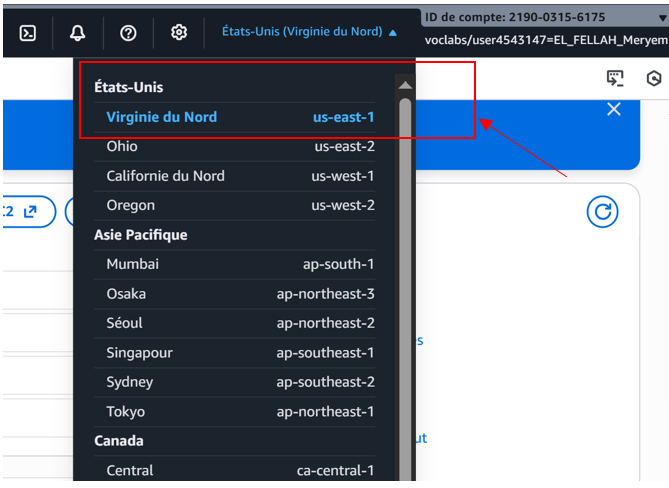

#### Sous-réseau (Subnet)
- **Nom** : `my_pub_subnet`
- **CIDR IPv4** : `10.0.0.0/16`
- **Fonction** : Zone publique de l'infrastructure

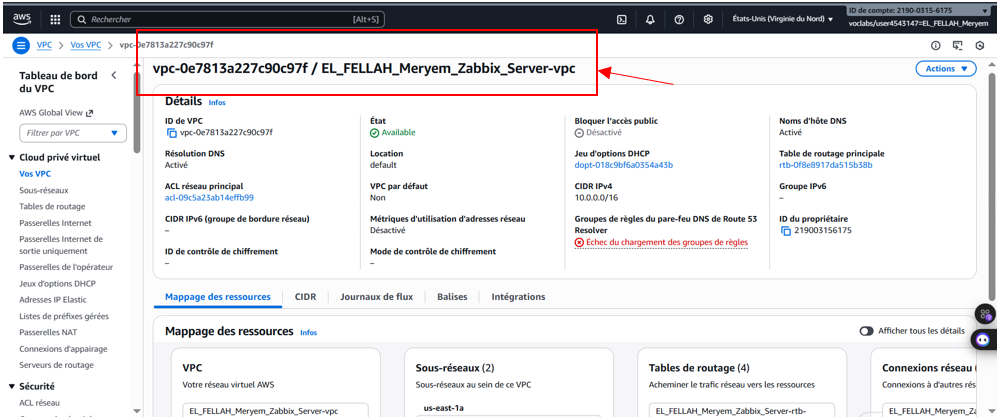

#### Groupe de Sécurité (Security Group)
- **Nom** : `EL_FELLAH_Meryem_ZabbixServerSG`
- **Rôle** : Pare-feu virtuel avec contrôle granulaire des flux

| Port | Protocole | Service | Source |
|------|-----------|---------|--------|
| 10050 | TCP | Zabbix Agent | 0.0.0.0/0 |
| 10051 | TCP | Zabbix Trapper | 0.0.0.0/0 |
| 80 | TCP | HTTP | 0.0.0.0/0 |
| 443 | TCP | HTTPS | 0.0.0.0/0 |
| 22 | TCP | SSH | 0.0.0.0/0 |
| 3389 | TCP | RDP | 0.0.0.0/0 |

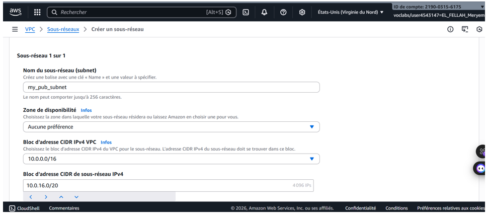
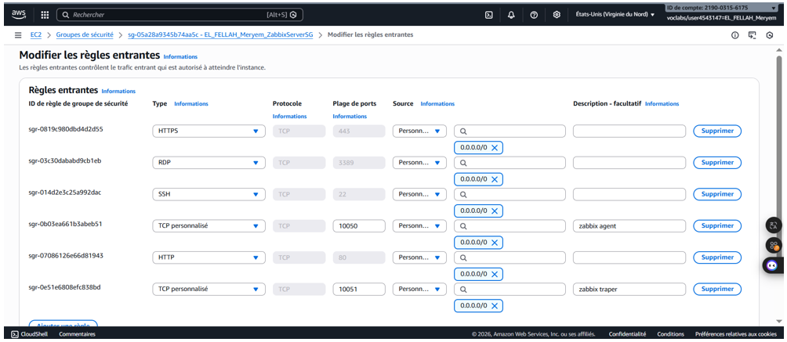

---

### 2.2 Inventaire des Instances EC2

#### Instance 1: Serveur Zabbix (Ubuntu)

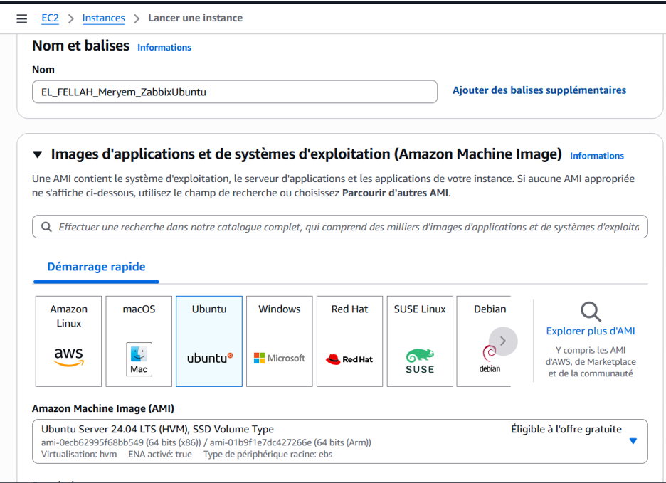


| Propriété | Valeur |
|-----------|--------|
| **Nom** | `EL_FELLAH_Meryem_ZabbixUbuntu` |
| **AMI** | Ubuntu Server 24.04 LTS (x86_64) |
| **Type d'instance** | t3.medium (2 vCPU, 4 Gio RAM) |
| **VPC** | `EL_FELLAH_Meryem_Zabbix_Server-vpc` |
| **Subnet** | `my_pub_subnet` |
| **IP Privée** | 10.0.3.253 |
| **Security Group** | `EL_FELLAH_Meryem_ZabbixServerSG` |
| **Paire de clés** | `cle_EL_FELLAH_Meryem_ZabbixUbuntu` |

**Rôle** : Héberge le serveur Zabbix, sa base de données PostgreSQL et l'interface web Nginx via Docker.

#### Instance 2: Client Linux Ubuntu

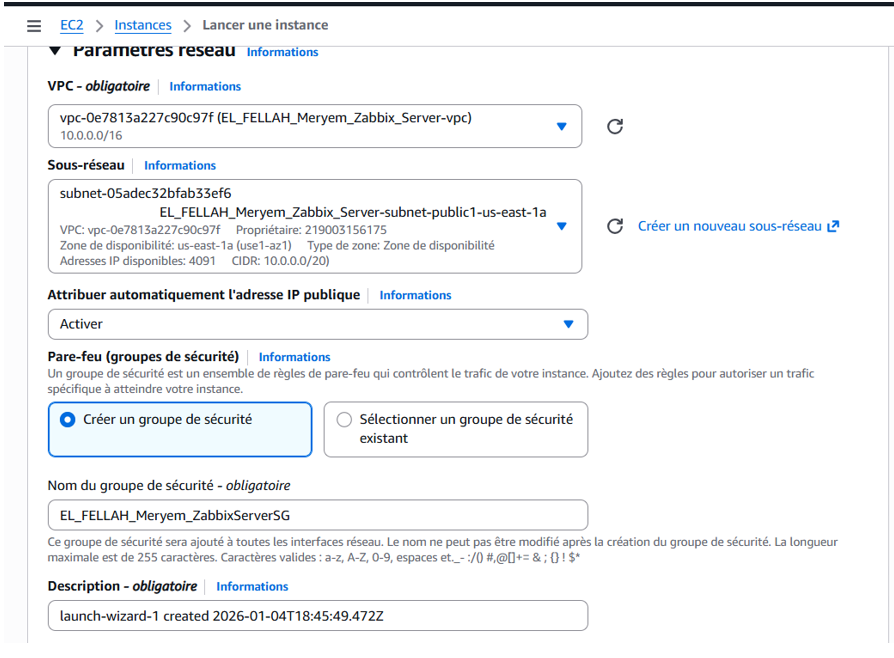

| Propriété | Valeur |
|-----------|--------|
| **Nom** | `LinuxClient_EL_FELLAH_Meryem` |
| **AMI** | Ubuntu Server 24.04 LTS |
| **Type d'instance** | t3.medium |
| **VPC** | `EL_FELLAH_Meryem_Zabbix_Server-vpc` |
| **Subnet** | `my_pub_subnet` |
| **IP Privée** | 10.0.3.160 |
| **Security Group** | `EL_FELLAH_Meryem_ZabbixServerSG` |

**Rôle** : Client supervisé avec agent Zabbix installé pour la collecte de métriques Linux.

#### Instance 3: Client Windows Server

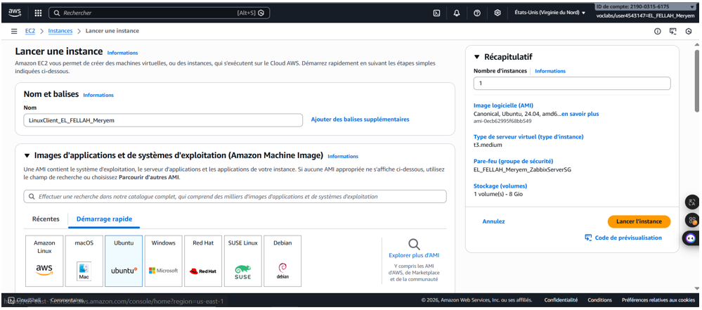
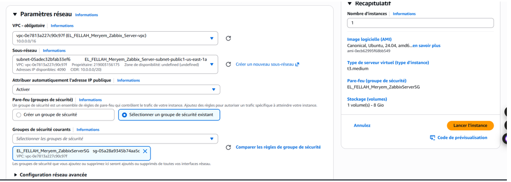

| Propriété | Valeur |
|-----------|--------|
| **Nom** | `Windows_Server_Client_EL_FELLAH_Meryem` |
| **AMI** | Windows Server 2025 Base (2025.12.10) |
| **Type d'instance** | t3.medium |
| **VPC** | `EL_FELLAH_Meryem_Zabbix_Server-vpc` |
| **Subnet** | `my_pub_subnet` |
| **IP Privée** | 10.0.14.60 |
| **Security Group** | `EL_FELLAH_Meryem_ZabbixServerSG` |

**Rôle** : Client Windows supervisé avec agent Zabbix pour validation de la supervision multi-plateforme.

---

## 🐳 Installation Docker & Zabbix

### 3.1 Connexion SSH au Serveur Zabbix

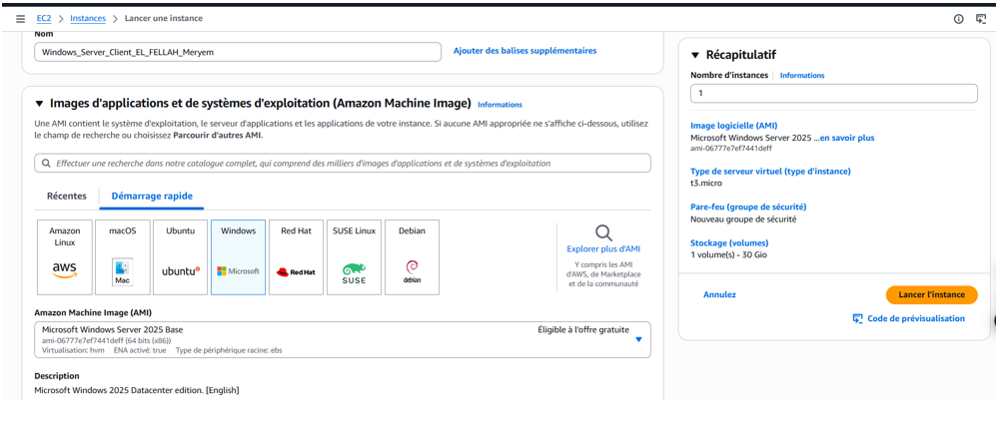

```bash
# Connexion à l'instance Ubuntu
ssh -i "cle_EL_FELLAH_Meryem_ZabbixUbuntu" ubuntu@3.229.97.142
```

**État du système** :
- Ubuntu 24.04.3 LTS
- IP Privée : 10.0.3.253
- État : Prêt pour l'installation

---

### 3.2 Installation de Docker

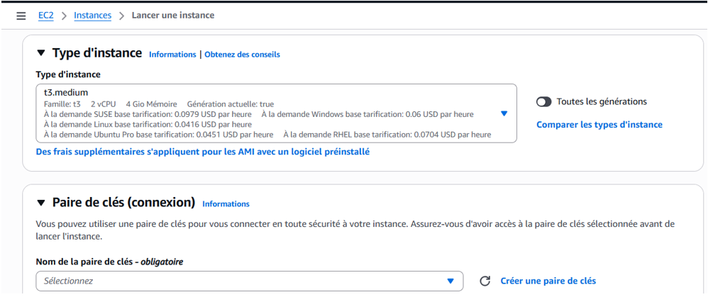

```bash
# Mise à jour du système
sudo apt update
sudo apt upgrade -y

# Installation de Docker et Docker-Compose
sudo apt install -y docker.io docker-compose

# Démarrage du service Docker
sudo systemctl start docker
sudo systemctl enable docker

# Vérification de l'installation
docker --version
docker-compose --version
```

---

### 3.3 Déploiement de Zabbix via Docker

#### Structure des Répertoires

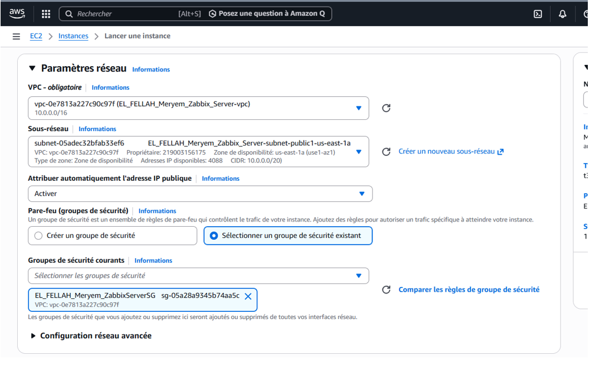

```bash
# Création du répertoire de travail
mkdir zabbix
cd zabbix

# Création du fichier docker-compose.yml
nano docker-compose.yml
```

#### Fichier docker-compose.yml

```yaml
version: '3.8'

services:
  postgres:
    image: postgres:16-alpine
    environment:
      POSTGRES_USER: zabbix
      POSTGRES_PASSWORD: zabbix
      POSTGRES_DB: zabbix
    volumes:
      - postgres_data:/var/lib/postgresql/data
    ports:
      - "5432:5432"

  zabbix-server:
    image: zabbix-server-pgsql:alpine-7.0-latest
    depends_on:
      - postgres
    environment:
      DB_SERVER_HOST: postgres
      POSTGRES_USER: zabbix
      POSTGRES_PASSWORD: zabbix
      POSTGRES_DB: zabbix
    ports:
      - "10051:10051"
    volumes:
      - zabbix_server_data:/var/lib/zabbix

  zabbix-web:
    image: zabbix-web-nginx-pgsql:alpine-7.0-latest
    depends_on:
      - postgres
      - zabbix-server
    environment:
      DB_SERVER_HOST: postgres
      POSTGRES_USER: zabbix
      POSTGRES_PASSWORD: zabbix
      POSTGRES_DB: zabbix
      ZBX_SERVER_HOST: zabbix-server
    ports:
      - "80:8080"
      - "443:8443"

volumes:
  postgres_data:
  zabbix_server_data:
```

**Architecture multi-conteneurs** :
- **Service postgres** : Base de données PostgreSQL 16 Alpine
- **Service zabbix-server** : Serveur Zabbix 7.0 dépendant de PostgreSQL
- **Service zabbix-web** : Interface web Nginx avec support PostgreSQL

#### Lancement de Zabbix

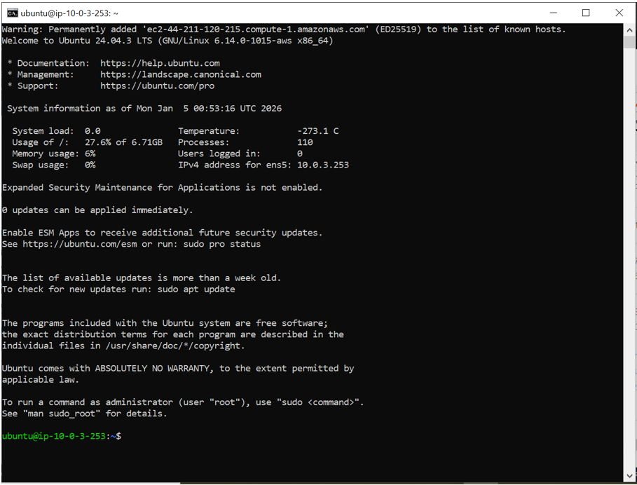

```bash
# Lancement des conteneurs en arrière-plan
docker-compose up -d

# Vérification des conteneurs actifs
docker ps
```

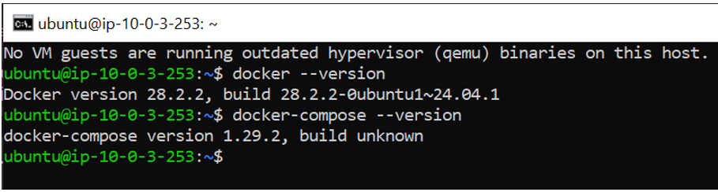

---

### 3.4 Initialisation de l'Interface Web Zabbix

#### Accès à la Console

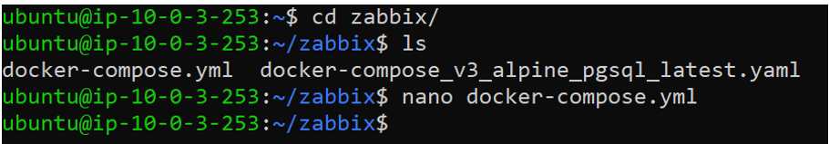

- **URL** : `http://3.229.97.142/`
- **Identifiants par défaut** :
  - Nom d'utilisateur : `Admin`
  - Mot de passe : `zabbix`

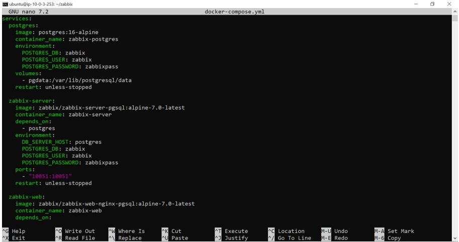

---

## 👥 Configuration des Agents

### 4.1 Installation de l'Agent Zabbix - Client Linux

#### Connexion SSH

```bash
ssh -i "cle_EL_FELLAH_Meryem" ubuntu@10.0.3.160
```

#### Installation de l'Agent

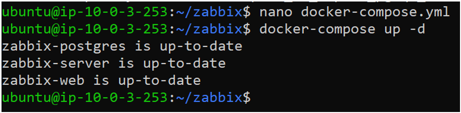

```bash
sudo apt update
sudo apt install -y zabbix-agent

sudo systemctl start zabbix-agent
sudo systemctl enable zabbix-agent
```

#### Configuration de l'Agent

```bash
sudo nano /etc/zabbix/zabbix_agentd.conf
```

**Modifications principales** :

```ini
Server=10.0.3.253              # IP privée du serveur Zabbix
ServerActive=10.0.3.253        # Pour les active checks
Hostname=LinuxClient_EL_FELLAH_Meryem
```

#### Création de l'Hôte dans Zabbix

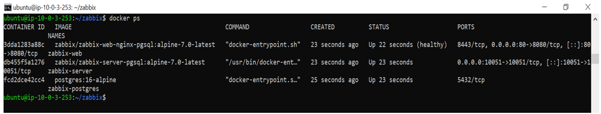

**Configuration** :
- **Host name** : `LinuxClient_EL_FELLAH_Meryem`
- **Type d'agent** : Agent
- **IP** : 10.0.3.160
- **Port** : 10050
- **Template** : Linux by Zabbix agent
- **Groupe d'hôtes** : Linux servers

**Résultat** : Statut ZBX vert ✅

---

### 4.2 Installation de l'Agent Zabbix - Client Windows

#### Connexion RDP

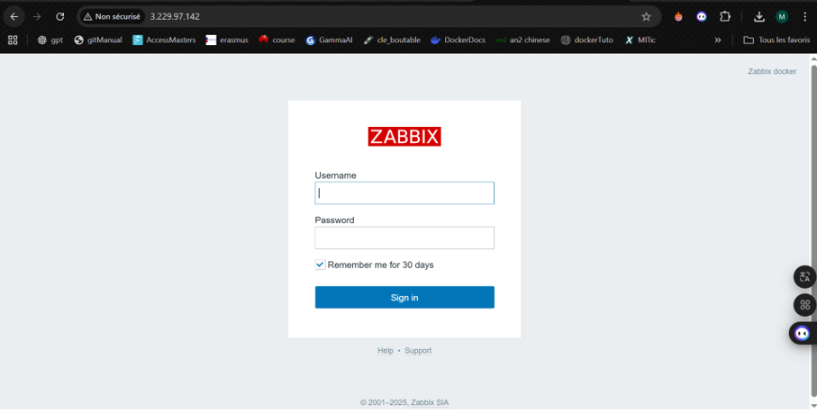

```
1. Télécharger le fichier de bureau à distance
2. Obtenir le mot de passe avec la clé d'instance
3. Déchiffrer et copier le mot de passe
4. Établir la connexion RDP
```

#### Session Windows Server

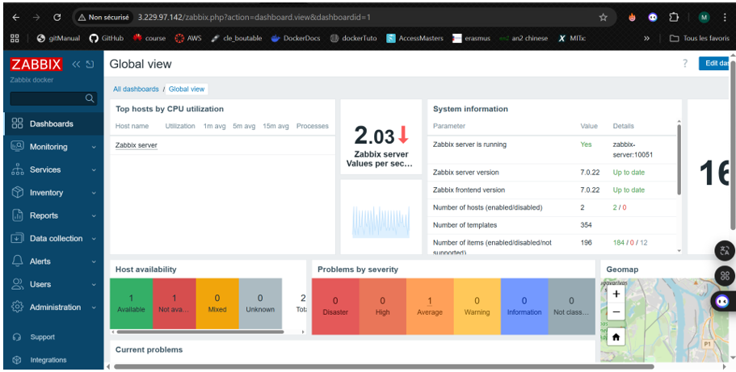

#### Téléchargement de l'Agent Zabbix

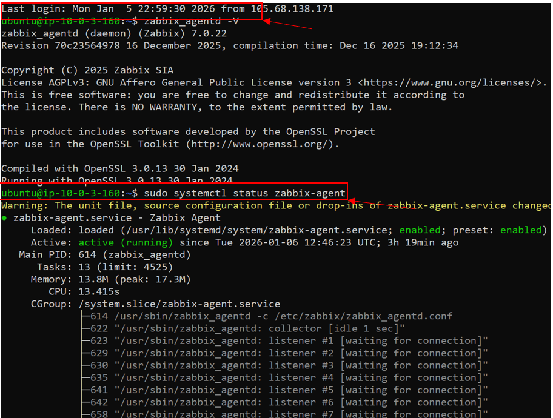

```
1. Ouvrir Microsoft Edge
2. Accéder à : https://www.zabbix.com/download_agents
3. Télécharger l'agent Windows .msi approprié
```

#### Installation de l'Agent

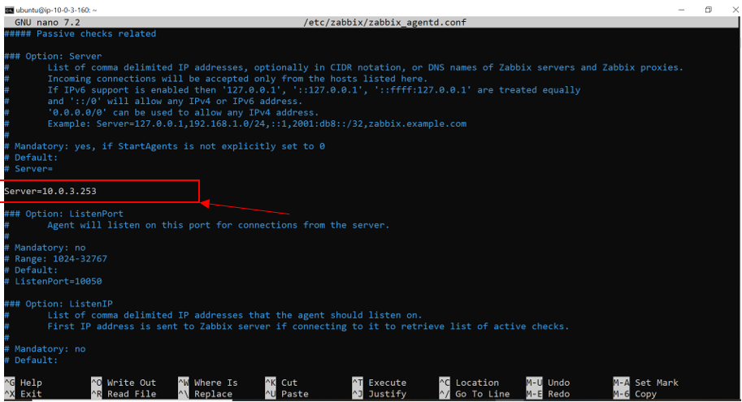
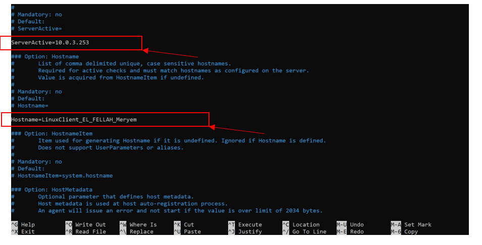

**Paramètres critiques d'installation** :

| Paramètre | Valeur |
|-----------|--------|
| **HostName** | `Windows_Server_Client_EL_FELLAH_Meryem` |
| **Zabbix server IP/DNS** | 10.0.3.253 (IP privée du serveur) |
| **Server or Proxy for active checks** | 10.0.3.253 |
| **Agent listen port** | 10050 |

⚠️ **Note importante** : Les paramètres Server et ServerActive doivent être configurés avec l'IP privée du serveur Zabbix pour assurer la communication interne au VPC.

#### Vérification du Service

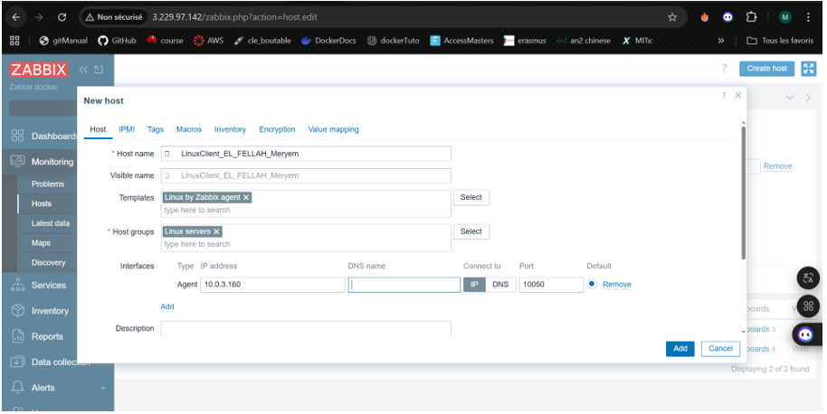

```
Win + R → services.msc → Rechercher "Zabbix Agent"
```

**État** : Service actif et en cours d'exécution ✅

#### Création de l'Hôte Windows dans Zabbix

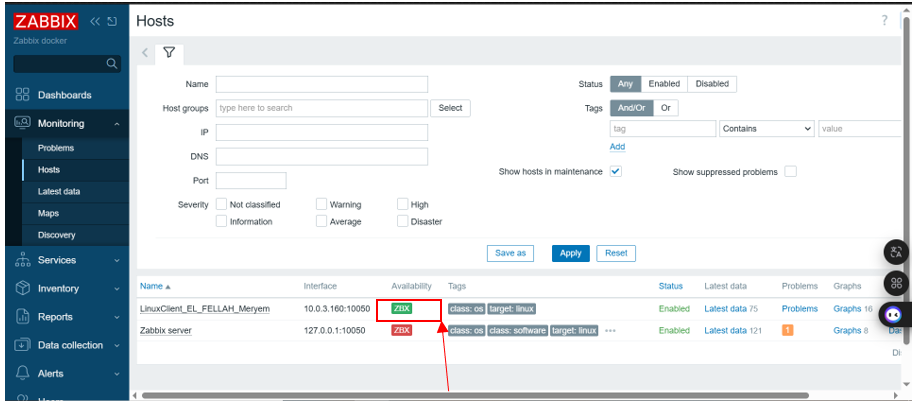

**Configuration** :
- **Host name** : `Windows_Server_Client_EL_FELLAH_Meryem`
- **Type d'agent** : Agent
- **IP** : 10.0.14.60
- **Port** : 10050
- **Template** : Windows by Zabbix agent
- **Groupe d'hôtes** : Windows servers

**Résultat** : Statut ZBX vert ✅

---

## 📊 Monitoring & Dashboards

### 5.1 Vérification de la Réception des Données

#### Données en Temps Réel (Latest Data)

Après ajout des hôtes, Zabbix visualise en temps réel les métriques système telles que l'utilisation CPU, la mémoire et l'espace disque.

#### Monitoring du Client Linux

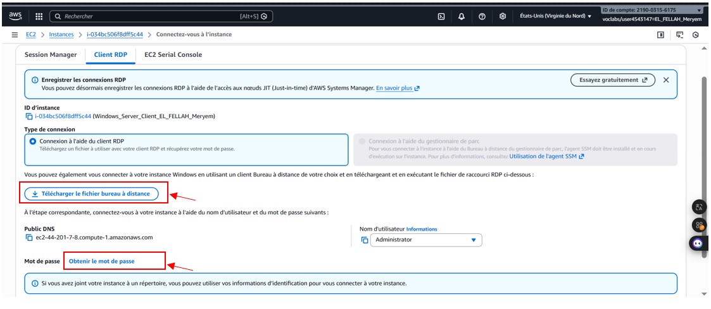

**Étapes** :
1. Aller à `Monitoring → Latest data`
2. Filtrer par le client Linux
3. Sélectionner la métrique "Memory Utilization"
4. Cliquer sur "Display Graph"

**Résultats** : Graphique clair montrant l'utilisation mémoire en temps réel

---

#### Monitoring du Client Windows

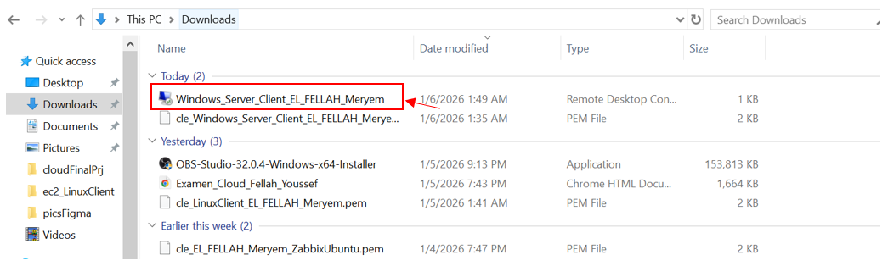
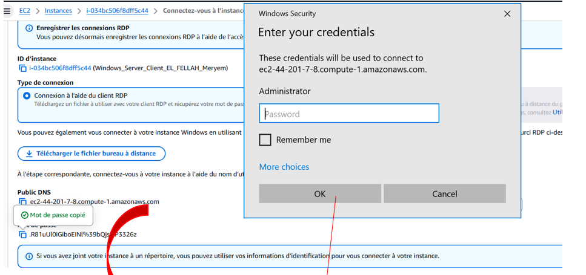

**Scenario de test** :
- Ouverture de 3 vidéos YouTube 8K
- Lancement de PowerShell et File Explorer
- Durée : 15+ minutes

**Observations** :
- Augmentation rapide entre 11:44 PM et 11:48 PM
- Pic de mémoire lors du lancement des vidéos
- Données collectées et graphées en temps réel

---

### 5.2 Détection des Problèmes et Alertes

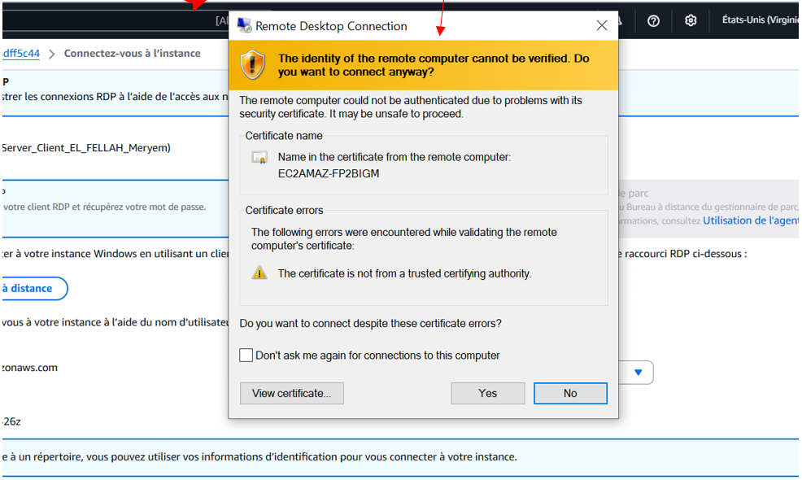
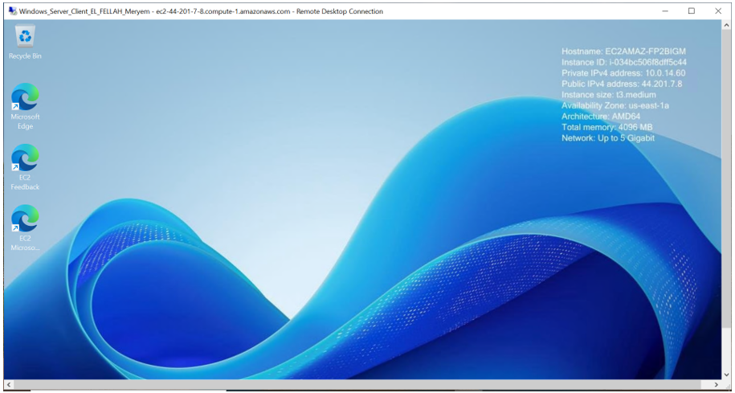

#### Capacités d'Alerting

| Aspect | Détail |
|--------|--------|
| **Monitoring des incidents** | Détection en temps réel de 4 événements sur client Windows |
| **Granularité** | Heure exacte, niveau de sévérité, nature du problème |
| **Sévérité** | Average (orange) et Critical pour services critiques |
| **Résolution** | Suivi du cycle de vie complet des incidents |

#### Exemples d'Alertes Détectées

- Arrêt inattendu du Windows Update Service
- Dépassement de seuils de performance
- Problèmes de connectivité réseau
- Utilisation excessive de ressources

#### Avantages pour l'Administration

✅ Centralisation des alertes  
✅ Intervention rapide sur composants critiques  
✅ Suivi de l'historique des incidents  
✅ Réduction du temps de réaction  

---

## 📈 Métriques Collectées

### Métriques Linux

```
- Utilisation CPU (%)
- Utilisation Mémoire (%)
- Utilisation Disque (%)
- Charge système (1, 5, 15 min)
- Nombre de processus
- État du réseau
- Trafic réseau
```

### Métriques Windows

```
- Utilisation CPU (%)
- Utilisation Mémoire (%)
- Utilisation Disque (%)
- État des services critiques
- Performances du système
- Logs d'événements
- État de santé globale
```

---

## 🔐 Sécurité et Bonnes Pratiques

### Sécurité Réseau

✅ VPC isolé pour l'infrastructure  
✅ Security Group avec règles granulaires  
✅ Communication interne via IPs privées  
✅ Authentification SSH et RDP sécurisée  

### Gestion des Conteneurs

✅ Images officielles Zabbix et PostgreSQL  
✅ Volumes persistants pour les données  
✅ Isolation des services via conteneurs  
✅ Docker-Compose pour orchestration simple  

### Monitoring

✅ Agents légers avec configuration centralisée  
✅ Alertes proactives  
✅ Historique complet des incidents  
✅ Interfaces web sécurisées (HTTP/HTTPS)  

---

## 📚 Ressources

- **Repository GitHub** : [infrastructure_cloud_supervision_centralis-e_AWS](https://github.com/merra3012/infrastructure_cloud_supervision_centralis-e_AWS)
- **Documentation Zabbix** : https://www.zabbix.com/documentation/7.0/
- **Documentation AWS** : https://docs.aws.amazon.com/
- **Docker Documentation** : https://docs.docker.com/
- **PostgreSQL Documentation** : https://www.postgresql.org/docs/

---

## 📝 Conclusions

Ce projet démontre la capacité à :

1. **Concevoir** une infrastructure cloud scalable sur AWS
2. **Déployer** des services conteneurisés avec Docker
3. **Configurer** une solution de monitoring centralisée robuste
4. **Superviser** un parc informatique hybride (Linux & Windows)
5. **Générer** des alertes intelligentes et proactives
6. **Maintenir** une infrastructure cloud résiliente

La solution Zabbix offre une visibilité complète sur l'infrastructure et permet une administration proactive des ressources cloud, essentielle pour garantir la continuité de service.

---

**Document généré à partir du rapport de projet**  
*Dernière mise à jour : 2026-01-07*
